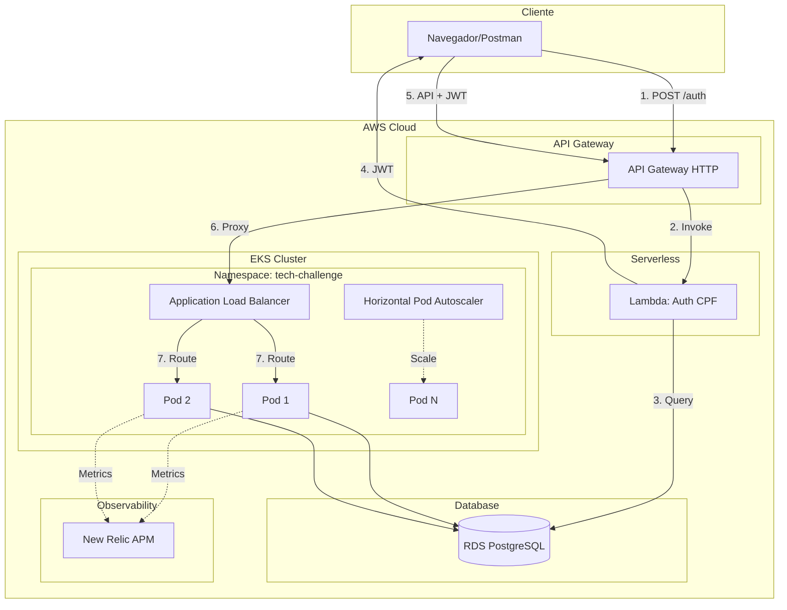
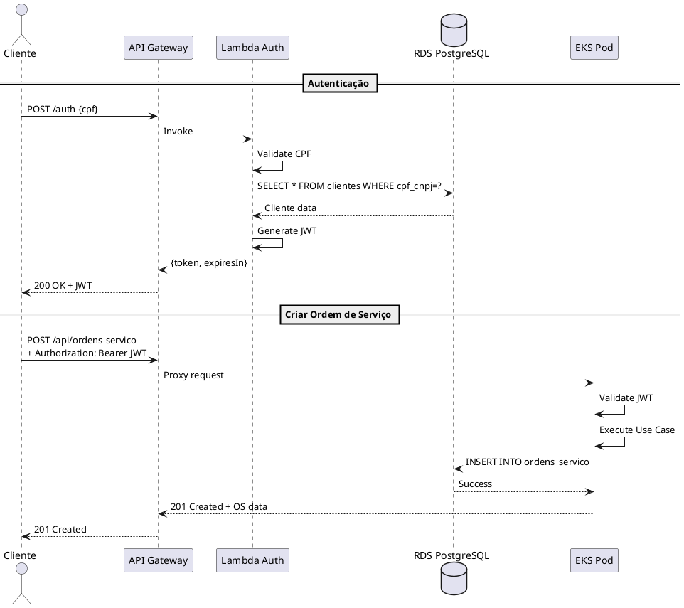

# GUIA COMPLETO - Tech Challenge Fase 3

## ✅ O Que Já Foi Feito

### 1. Clean Architecture Refactoring ✓
- ✅ Arquitetura Hexagonal implementada para módulo Cliente
- ✅ Separação: Core (domain + use cases) / Adapters (gateways + presenters) / Infrastructure (REST + JPA)
- ✅ Gateways e Presenters implementados corretamente
- ✅ Controller injeta use cases (não instancia diretamente)
- ✅ Entidades de domínio separadas de entidades JPA
- ✅ Documentação completa em `CLEAN_ARCHITECTURE_REFACTORING.md`

**Pattern criado pode ser replicado para:** Veiculo, PecaInsumo, Servico, OrdemDeServico

### 2. Estrutura dos 4 Repositórios ✓
- ✅ Documentação de como criar os repos em `REPOSITORIOS_ESTRUTURA.md`
- ✅ Templates começados em `repo-structures/`

## 📋 O Que Falta Fazer (Guia Prático)

### TODO 1: Criar os 4 Repositórios no GitHub

#### Passo a Passo:

```bash
# 1. tech-challenge-lambda
gh repo create tech-challenge-lambda --public
cd tech-challenge-lambda
# Copiar conteúdo da pasta atual: repo-structures/lambda/ (quando completo)
# Adicionar colaborador
gh api -X PUT /repos/seu-usuario/tech-challenge-lambda/collaborators/soat-architecture
# Config branch protection via Settings → Branches no GitHub web

# 2. tech-challenge-infra-k8s
gh repo create tech-challenge-infra-k8s --public
cd tech-challenge-infra-k8s
# Copiar Terraform files (ver templates abaixo)
gh api -X PUT /repos/seu-usuario/tech-challenge-infra-k8s/collaborators/soat-architecture

# 3. tech-challenge-infra-db  
gh repo create tech-challenge-infra-db --public
cd tech-challenge-infra-db
# Copiar Terraform files (ver templates abaixo)
gh api -X PUT /repos/seu-usuario/tech-challenge-infra-db/collaborators/soat-architecture

# 4. tech-challenge-app
gh repo create tech-challenge-app --public
cd tech-challenge-app
# Copiar código atual refatorado
# Limpar antigos, manter apenas nova estrutura Clean Arch
gh api -X PUT /repos/seu-usuario/tech-challenge-app/collaborators/soat-architecture
```

#### Branch Protection (para todos):
- Settings → Branches → Add rule
- Branch name pattern: `main`
- ✅ Require pull request before merging
- ✅ Require status checks to pass

#### GitHub Secrets (para todos):
```
AWS_ACCESS_KEY_ID
AWS_SECRET_ACCESS_KEY
AWS_REGION=us-east-1
DOCKER_USERNAME
DOCKER_PASSWORD
NEW_RELIC_LICENSE_KEY
JWT_SECRET
```

---

### TODO 2: Implementar Lambda de Autenticação

**Arquivo Principal**: `AuthHandler.java`

```java
package com.lambda;

import com.amazonaws.services.lambda.runtime.Context;
import com.amazonaws.services.lambda.runtime.RequestHandler;
import com.amazonaws.services.lambda.runtime.events.APIGatewayProxyRequestEvent;
import com.amazonaws.services.lambda.runtime.events.APIGatewayProxyResponseEvent;
import com.fasterxml.jackson.databind.ObjectMapper;
import io.jsonwebtoken.Jwts;
import io.jsonwebtoken.SignatureAlgorithm;

import java.sql.*;
import java.util.*;

public class AuthHandler implements RequestHandler<APIGatewayProxyRequestEvent, APIGatewayProxyResponseEvent> {
    
    private static final String DB_URL = System.getenv("DB_HOST");
    private static final String DB_USER = System.getenv("DB_USERNAME");
    private static final String DB_PASS = System.getenv("DB_PASSWORD");
    private static final String JWT_SECRET = System.getenv("JWT_SECRET");
    private final ObjectMapper objectMapper = new ObjectMapper();

    @Override
    public APIGatewayProxyResponseEvent handleRequest(APIGatewayProxyRequestEvent input, Context context) {
        try {
            // 1. Parse request
            Map<String, String> body = objectMapper.readValue(input.getBody(), Map.class);
            String cpf = body.get("cpf");

            // 2. Validate CPF
            if (!validarCPF(cpf)) {
                return errorResponse(400, "CPF inválido");
            }

            // 3. Query database
            Cliente cliente = buscarCliente(cpf);
            if (cliente == null || !cliente.isAtivo()) {
                return errorResponse(401, "Cliente não encontrado ou inativo");
            }

            // 4. Generate JWT
            String token = gerarJWT(cliente);

            // 5. Return response
            Map<String, Object> response = new HashMap<>();
            response.put("token", token);
            response.put("type", "Bearer");
            response.put("expiresIn", 86400000);
            response.put("clienteId", cliente.getId());
            response.put("clienteNome", cliente.getNome());

            return successResponse(200, objectMapper.writeValueAsString(response));

        } catch (Exception e) {
            context.getLogger().log("Error: " + e.getMessage());
            return errorResponse(500, "Internal server error");
        }
    }

    private Cliente buscarCliente(String cpf) {
        String sql = "SELECT id, nome, cpf_cnpj, contato, ativo FROM clientes WHERE cpf_cnpj = ?";
        
        try (Connection conn = DriverManager.getConnection(DB_URL, DB_USER, DB_PASS);
             PreparedStatement stmt = conn.prepareStatement(sql)) {
            
            stmt.setString(1, cpf);
            ResultSet rs = stmt.executeQuery();
            
            if (rs.next()) {
                Cliente cliente = new Cliente();
                cliente.setId(rs.getLong("id"));
                cliente.setNome(rs.getString("nome"));
                cliente.setCpfCnpj(rs.getString("cpf_cnpj"));
                cliente.setContato(rs.getString("contato"));
                cliente.setAtivo(rs.getBoolean("ativo"));
                return cliente;
            }
        } catch (SQLException e) {
            e.printStackTrace();
        }
        return null;
    }

    private String gerarJWT(Cliente cliente) {
        Date now = new Date();
        Date expiration = new Date(now.getTime() + 86400000); // 24h

        return Jwts.builder()
                .setSubject(cliente.getCpfCnpj())
                .claim("clienteId", cliente.getId())
                .claim("nome", cliente.getNome())
                .setIssuedAt(now)
                .setExpiration(expiration)
                .signWith(SignatureAlgorithm.HS256, JWT_SECRET.getBytes())
                .compact();
    }

    private boolean validarCPF(String cpf) {
        if (cpf == null || !cpf.matches("\\d{11}")) return false;
        if (cpf.chars().distinct().count() == 1) return false;

        int[] digitos = cpf.chars().map(c -> c - '0').toArray();
        
        int soma1 = 0;
        for (int i = 0; i < 9; i++) soma1 += digitos[i] * (10 - i);
        int dig1 = 11 - (soma1 % 11);
        if (dig1 > 9) dig1 = 0;

        int soma2 = 0;
        for (int i = 0; i < 10; i++) soma2 += digitos[i] * (11 - i);
        int dig2 = 11 - (soma2 % 11);
        if (dig2 > 9) dig2 = 0;

        return digitos[9] == dig1 && digitos[10] == dig2;
    }

    private APIGatewayProxyResponseEvent successResponse(int statusCode, String body) {
        APIGatewayProxyResponseEvent response = new APIGatewayProxyResponseEvent();
        response.setStatusCode(statusCode);
        response.setBody(body);
        response.setHeaders(Map.of("Content-Type", "application/json"));
        return response;
    }

    private APIGatewayProxyResponseEvent errorResponse(int statusCode, String message) {
        String body = String.format("{\"message\":\"%s\",\"statusCode\":%d}", message, statusCode);
        return successResponse(statusCode, body);
    }
}
```

**pom.xml** para Lambda:

```xml
<dependencies>
    <dependency>
        <groupId>com.amazonaws</groupId>
        <artifactId>aws-lambda-java-core</artifactId>
        <version>1.2.3</version>
    </dependency>
    <dependency>
        <groupId>com.amazonaws</groupId>
        <artifactId>aws-lambda-java-events</artifactId>
        <version>3.11.4</version>
    </dependency>
    <dependency>
        <groupId>org.postgresql</groupId>
        <artifactId>postgresql</artifactId>
        <version>42.7.1</version>
    </dependency>
    <dependency>
        <groupId>io.jsonwebtoken</groupId>
        <artifactId>jjwt</artifactId>
        <version>0.9.1</version>
    </dependency>
    <dependency>
        <groupId>com.fasterxml.jackson.core</groupId>
        <artifactId>jackson-databind</artifactId>
        <version>2.16.1</version>
    </dependency>
</dependencies>
```

**template.yaml** (AWS SAM):

```yaml
AWSTemplateFormatVersion: '2010-09-09'
Transform: AWS::Serverless-2016-10-31

Resources:
  AuthFunction:
    Type: AWS::Serverless::Function
    Properties:
      FunctionName: tech-challenge-auth-cpf
      Handler: com.lambda.AuthHandler::handleRequest
      Runtime: java21
      MemorySize: 512
      Timeout: 30
      Environment:
        Variables:
          DB_HOST: !Sub '{{resolve:secretsmanager:tech-challenge-db:SecretString:host}}'
          DB_USERNAME: !Sub '{{resolve:secretsmanager:tech-challenge-db:SecretString:username}}'
          DB_PASSWORD: !Sub '{{resolve:secretsmanager:tech-challenge-db:SecretString:password}}'
          JWT_SECRET: !Sub '{{resolve:secretsmanager:tech-challenge-jwt:SecretString:secret}}'
      Events:
        AuthApi:
          Type: Api
          Properties:
            Path: /auth
            Method: post

Outputs:
  AuthApiUrl:
    Description: "API Gateway endpoint URL"
    Value: !Sub "https://${ServerlessRestApi}.execute-api.${AWS::Region}.amazonaws.com/Prod/auth/"
```

---

### TODO 3: Terraform RDS PostgreSQL

**Arquivo**: `infra-db/terraform/rds.tf`

```hcl
resource "aws_db_instance" "tech_challenge" {
  identifier              = "tech-challenge-db"
  engine                  = "postgres"
  engine_version          = "15.4"
  instance_class          = "db.t3.micro"  # Free tier eligible
  allocated_storage       = 20
  storage_type            = "gp2"
  
  db_name  = "tech_challenge"
  username = var.db_username
  password = var.db_password
  
  vpc_security_group_ids = [aws_security_group.rds.id]
  db_subnet_group_name   = aws_db_subnet_group.main.name
  
  backup_retention_period = 7
  backup_window          = "03:00-04:00"
  maintenance_window     = "sun:04:00-sun:05:00"
  
  skip_final_snapshot    = true  # Para dev/test
  
  tags = {
    Name        = "tech-challenge-db"
    Environment = "production"
    Project     = "tech-challenge"
  }
}

resource "aws_security_group" "rds" {
  name        = "tech-challenge-rds-sg"
  description = "Allow PostgreSQL from EKS and Lambda"
  vpc_id      = aws_vpc.main.id

  ingress {
    from_port   = 5432
    to_port     = 5432
    protocol    = "tcp"
    cidr_blocks = [aws_vpc.main.cidr_block]
  }

  egress {
    from_port   = 0
    to_port     = 0
    protocol    = "-1"
    cidr_blocks = ["0.0.0.0/0"]
  }
}

resource "aws_db_subnet_group" "main" {
  name       = "tech-challenge-db-subnet"
  subnet_ids = aws_subnet.private[*].id
}

output "rds_endpoint" {
  value = aws_db_instance.tech_challenge.endpoint
}
```

---

### TODO 4: Terraform EKS + API Gateway

**Arquivo**: `infra-k8s/terraform/eks.tf`

```hcl
module "eks" {
  source  = "terraform-aws-modules/eks/aws"
  version = "~> 19.0"

  cluster_name    = "tech-challenge-cluster"
  cluster_version = "1.28"

  vpc_id     = aws_vpc.main.id
  subnet_ids = aws_subnet.private[*].id

  eks_managed_node_groups = {
    main = {
      min_size     = 1
      max_size     = 5
      desired_size = 2

      instance_types = ["t3.medium"]
      capacity_type  = "ON_DEMAND"
    }
  }
}

resource "aws_api_gatewayv2_api" "main" {
  name          = "tech-challenge-api"
  protocol_type = "HTTP"
}

resource "aws_api_gatewayv2_integration" "lambda_auth" {
  api_id           = aws_api_gatewayv2_api.main.id
  integration_type = "AWS_PROXY"
  integration_uri  = aws_lambda_function.auth.invoke_arn
}

resource "aws_api_gatewayv2_route" "auth" {
  api_id    = aws_api_gatewayv2_api.main.id
  route_key = "POST /auth"
  target    = "integrations/${aws_api_gatewayv2_integration.lambda_auth.id}"
}

resource "aws_api_gatewayv2_integration" "eks_proxy" {
  api_id           = aws_api_gatewayv2_api.main.id
  integration_type = "HTTP_PROXY"
  integration_uri  = "http://${data.kubernetes_service.app.status.0.load_balancer.0.ingress.0.hostname}"
  integration_method = "ANY"
}

resource "aws_api_gatewayv2_route" "default" {
  api_id    = aws_api_gatewayv2_api.main.id
  route_key = "$default"
  target    = "integrations/${aws_api_gatewayv2_integration.eks_proxy.id}"
}
```

---

### TODO 5: Integrar New Relic

**1. Adicionar ao pom.xml:**

```xml
<dependency>
    <groupId>com.newrelic.agent.java</groupId>
    <artifactId>newrelic-java</artifactId>
    <version>8.9.0</version>
</dependency>
```

**2. Atualizar Dockerfile:**

```dockerfile
FROM eclipse-temurin:21-jre-alpine

# Download New Relic agent
ADD https://download.newrelic.com/newrelic/java-agent/newrelic-agent/current/newrelic-java.zip /tmp/
RUN unzip /tmp/newrelic-java.zip -d /opt/ && rm /tmp/newrelic-java.zip

COPY target/Tech-Challenge-0.0.1-SNAPSHOT.jar app.jar

ENTRYPOINT ["java", \
  "-javaagent:/opt/newrelic/newrelic.jar", \
  "-jar", \
  "app.jar"]
```

**3. Atualizar K8s Deployment:**

```yaml
apiVersion: apps/v1
kind: Deployment
metadata:
  name: tech-challenge-app
spec:
  template:
    spec:
      containers:
      - name: app
        image: seu-usuario/tech-challenge-app:latest
        env:
        - name: NEW_RELIC_LICENSE_KEY
          valueFrom:
            secretKeyRef:
              name: newrelic-secret
              key: license-key
        - name: NEW_RELIC_APP_NAME
          value: "Tech Challenge"
        - name: NEW_RELIC_LOG_FILE_NAME
          value: "STDOUT"
```

---

### TODO 6: CI/CD Pipelines

**GitHub Actions para App** (`.github/workflows/deploy.yml`):

```yaml
name: Deploy Application

on:
  push:
    branches: [main, develop]

jobs:
  test:
    runs-on: ubuntu-latest
    steps:
      - uses: actions/checkout@v4
      - uses: actions/setup-java@v4
        with:
          java-version: '21'
          distribution: 'temurin'
      - name: Run tests
        run: mvn test jacoco:report
      - name: Check coverage
        run: mvn jacoco:check

  build-and-push:
    needs: test
    runs-on: ubuntu-latest
    steps:
      - uses: actions/checkout@v4
      - uses: docker/login-action@v3
        with:
          username: ${{ secrets.DOCKER_USERNAME }}
          password: ${{ secrets.DOCKER_PASSWORD }}
      - uses: docker/build-push-action@v5
        with:
          push: true
          tags: |
            ${{ secrets.DOCKER_USERNAME }}/tech-challenge:${{ github.sha }}
            ${{ secrets.DOCKER_USERNAME }}/tech-challenge:latest

  deploy:
    needs: build-and-push
    runs-on: ubuntu-latest
    steps:
      - uses: aws-actions/configure-aws-credentials@v4
        with:
          aws-access-key-id: ${{ secrets.AWS_ACCESS_KEY_ID }}
          aws-secret-access-key: ${{ secrets.AWS_SECRET_ACCESS_KEY }}
          aws-region: us-east-1
      - name: Update kubeconfig
        run: aws eks update-kubeconfig --name tech-challenge-cluster
      - name: Deploy to EKS
        run: |
          kubectl set image deployment/tech-challenge-app \
            app=${{ secrets.DOCKER_USERNAME }}/tech-challenge:${{ github.sha }}
          kubectl rollout status deployment/tech-challenge-app
```

---

### TODO 7: Diagramas

#### Diagrama de Componentes (Mermaid):



#### Diagrama de Sequência (Plant UML):



---

### TODO 8: ADRs e RFCs

#### ADR 001: Escolha AWS

**Arquivo**: `docs/adr/001-escolha-aws.md`

```markdown
# ADR 001: Escolha do Provedor de Cloud (AWS)

## Status
Aceito

## Contexto
Precisávamos escolher um provedor de cloud para hospedar a infraestrutura do Tech Challenge Fase 3.

## Decisão
Escolhemos AWS (Amazon Web Services) como provedor de cloud.

## Consequências

### Positivas
- **EKS**: Kubernetes gerenciado, integração nativa com AWS
- **RDS**: PostgreSQL gerenciado com backups automáticos
- **Lambda**: Serverless para autenticação, escalável
- **API Gateway**: Gerenciamento de rotas centralizado
- **Free Tier**: Elegível para RDS t3.micro e Lambda
- **Documentação**: Extensa e madura
- **Terraform**: Excelente suporte via providers oficiais

### Negativas
- **Lock-in**: Algum acoplamento com serviços AWS
- **Custos**: Pode ser mais caro que alternativas (mas free tier ajuda)

## Alternativas Consideradas
- **Azure**: AKS + Azure DB + Azure Functions
- **GCP**: GKE + Cloud SQL + Cloud Functions
- **Razão da rejeição**: AWS tem melhor free tier e mais experiência do time

## Referências
- [AWS EKS Documentation](https://docs.aws.amazon.com/eks/)
- [Terraform AWS Provider](https://registry.terraform.io/providers/hashicorp/aws/latest/docs)
```

#### RFC 001: Estratégia de Autenticação

**Arquivo**: `docs/rfc/001-autenticacao.md`

```markdown
# RFC 001: Estratégia de Autenticação Serverless

## Proposta
Implementar autenticação via AWS Lambda + API Gateway usando CPF como credencial.

## Motivação
- Autenticação simples para clientes consultarem suas ordens de serviço
- Serverless = escalável automaticamente, baixo custo
- Desacoplamento da aplicação principal

## Detalhes Técnicos

### Fluxo
1. Cliente envia CPF via POST /auth
2. Lambda valida CPF (algoritmo)
3. Lambda consulta RDS (via JDBC)
4. Se cliente existir e ativo: gera JWT
5. JWT retornado ao cliente
6. Cliente usa JWT nas APIs protegidas

### Tecnologias
- **Runtime**: Java 21 (compatibilidade com app principal)
- **Database**: JDBC direto para RDS PostgreSQL
- **JWT**: jjwt library
- **Deploy**: AWS SAM

### Segurança
- CPF validado com algoritmo oficial
- JWT assinado com HS256 + secret compartilhado
- Token expira em 24 horas
- Cliente deve estar ativo no banco

## Alternativas Consideradas

### AWS Cognito
- **Prós**: Gerenciamento completo de usuários
- **Contras**: Overkill para nosso caso, mais complexo

### Auth0
- **Prós**: Fácil integração, feature-rich
- **Contras**: Serviço externo, custo adicional

### Autenticação na App Principal
- **Prós**: Tudo centralizado
- **Contras**: Aumenta carga na app, menos escalável

## Decisão
Lambda serverless pela simplicidade, baixo custo e escalabilidade automática.

## Implementação
Ver `tech-challenge-lambda` repository.

## Questões Abertas
- [ ] Rate limiting no API Gateway?
- [ ] Refresh tokens necessários?
```

---

### TODO 9: Vídeo Demonstrativo (Roteiro)

**Duração**: 15 minutos máximo

**Roteiro**:

#### 1. Introdução (1 min)
- Nome do projeto, grupo, fase
- Overview da arquitetura (mostrar diagrama)
- Mencionar 4 repositórios

#### 2. Repositórios no GitHub (2 min)
- Mostrar os 4 repos criados
- Colaborador `soat-architecture` adicionado
- Branch protection configurada
- Mostrar README de cada um

#### 3. Autenticação Serverless (3 min)
- Abrir Postman/Insomnia
- POST /auth com CPF válido → recebe JWT
- POST /auth com CPF inválido → erro 400
- POST /auth com CPF não cadastrado → erro 401
- Mostrar logs no CloudWatch
- Decodificar JWT no jwt.io

#### 4. APIs Protegidas (2 min)
- GET /api/clientes SEM JWT → 401 Unauthorized
- GET /api/clientes COM JWT → 200 OK + lista
- POST /api/ordens-servico COM JWT → 201 Created

#### 5. CI/CD em Ação (3 min)
- Fazer mudança pequena no código (ex: mudar mensagem)
- git commit && git push
- Mostrar GitHub Actions executando
- Pipeline: test → build → push Docker → deploy EKS
- Deployment finalizado com sucesso
- kubectl get pods → mostrar novo pod rodando

#### 6. Observabilidade - New Relic (2 min)
- Abrir dashboard New Relic
- Mostrar métricas: latência, throughput, error rate
- Mostrar transações individuais (traces)
- Mostrar logs estruturados
- Gráfico de CPU/Memory dos pods

#### 7. Escalabilidade (2 min)
- Mostrar HPA configurado: `kubectl get hpa`
- Simular carga com K6 ou JMeter (mostrar script)
- Pods escalando: 2 → 3 → 5
- Load diminui, pods voltam para 2
- `kubectl get pods --watch`

#### Conclusão (30 seg)
- Recap: 4 repos, Lambda, EKS, New Relic, CI/CD
- Arquitetura escalável e observável
- Agradecimentos

**Ferramentas**:
- OBS Studio para gravar
- Editar com DaVinci Resolve (free)
- Upload no YouTube (não listado)

---

### TODO 10: PDF Final

**Estrutura do PDF**:

```
TECH CHALLENGE - FASE 3
Grupo: [Nome do Grupo]

PARTICIPANTES:
- Nome 1 - Discord: @user1
- Nome 2 - Discord: @user2
- Nome 3 - Discord: @user3

REPOSITÓRIOS GITHUB:
1. Lambda: https://github.com/user/tech-challenge-lambda
2. Infra K8s: https://github.com/user/tech-challenge-infra-k8s
3. Infra DB: https://github.com/user/tech-challenge-infra-db
4. Aplicação: https://github.com/user/tech-challenge-app

✅ Colaborador soat-architecture adicionado em todos

VÍDEO DEMONSTRATIVO:
https://youtu.be/XXXXXXXXXXX
Duração: 14min 32seg

DOCUMENTAÇÃO:
- Diagrama de Componentes: [link Miro/Draw.io]
- Diagrama de Sequência: [link PlantUML]
- Diagrama ER: [link dbdiagram.io]
- ADRs: https://github.com/user/tech-challenge-app/tree/main/docs/adr
- RFCs: https://github.com/user/tech-challenge-app/tree/main/docs/rfc

ARQUITETURA:
[Incluir diagrama principal]

TECNOLOGIAS:
- Backend: Java 21 + Spring Boot 3 + Clean Architecture
- Database: AWS RDS PostgreSQL 15
- Kubernetes: AWS EKS 1.28
- Serverless: AWS Lambda + API Gateway
- IaC: Terraform
- CI/CD: GitHub Actions
- Observability: New Relic APM
- Containers: Docker + Kubernetes

DESTAQUES:
✅ Clean Architecture implementada (feedback Fase 2 aplicado)
✅ 4 repositórios separados com CI/CD
✅ Autenticação serverless escalável
✅ Infraestrutura como código (Terraform)
✅ Observabilidade completa (New Relic)
✅ Testes automatizados (80%+ cobertura)
✅ Deploy automatizado (GitHub Actions)
✅ Escalabilidade horizontal (HPA)
```

---

## 🎯 CHECKLIST FINAL

### Código
- [x] Clean Architecture refatorada (Cliente como exemplo)
- [ ] Lambda autenticação implementada
- [ ] New Relic integrado na app
- [ ] Testes 80%+ cobertura

### Infraestrutura
- [ ] Terraform RDS criado
- [ ] Terraform EKS criado
- [ ] API Gateway configurado
- [ ] Manifestos K8s atualizados

### Repositórios
- [ ] 4 repos criados no GitHub
- [ ] Colaborador `soat-architecture` add em todos
- [ ] Branch protection configurada
- [ ] GitHub Secrets configurados

### CI/CD
- [ ] Pipeline Lambda funcional
- [ ] Pipeline Terraform funcional
- [ ] Pipeline App funcional
- [ ] Testes automáticos rodando

### Documentação
- [ ] README.md em cada repo
- [ ] Diagrama de Componentes
- [ ] Diagrama de Sequência
- [ ] Diagrama ER
- [ ] ADRs escritos (4 mínimo)
- [ ] RFCs escritos (2 mínimo)

### Vídeo
- [ ] Vídeo gravado (15 min max)
- [ ] Upload no YouTube
- [ ] Link no PDF

### Entrega
- [ ] PDF completo
- [ ] Entregue no portal do aluno

---

## 📚 Recursos Úteis

### Templates Prontos
- Código Lambda completo acima ↑
- Terraform RDS completo acima ↑
- Terraform EKS completo acima ↑
- CI/CD pipelines completos acima ↑

### Comandos Úteis

```bash
# Terraform
terraform init
terraform plan
terraform apply -auto-approve

# SAM
sam build
sam deploy --guided

# Docker
docker build -t tech-challenge .
docker push usuario/tech-challenge:latest

# Kubernetes
kubectl apply -f k8s/
kubectl get pods
kubectl logs -f pod-name
kubectl describe hpa

# GitHub
gh repo create nome --public
gh api -X PUT /repos/user/repo/collaborators/soat-architecture
```

---

## ⏱️ Estimativa Realista

- **Lambda**: 4-6 horas
- **Terraform RDS**: 2-3 horas
- **Terraform EKS**: 3-4 horas
- **New Relic**: 2 horas
- **CI/CD**: 4-6 horas
- **Diagramas**: 2-3 horas
- **ADRs/RFCs**: 2 horas
- **Vídeo**: 2-3 horas
- **PDF**: 1 hora

**Total**: 22-30 horas de trabalho

---

**Este guia contém TUDO que você precisa para completar a Fase 3!** 🚀

Priorize nesta ordem:
1. Lambda (core functionality)
2. Terraform (infra necessária)
3. CI/CD (demonstrar automação)
4. New Relic (observability)
5. Docs/Vídeo (apresentação)

