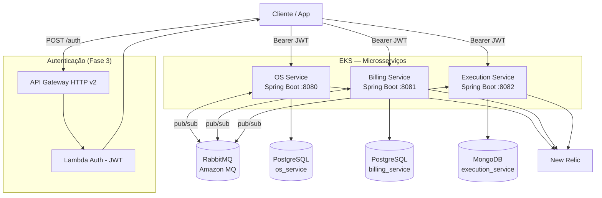
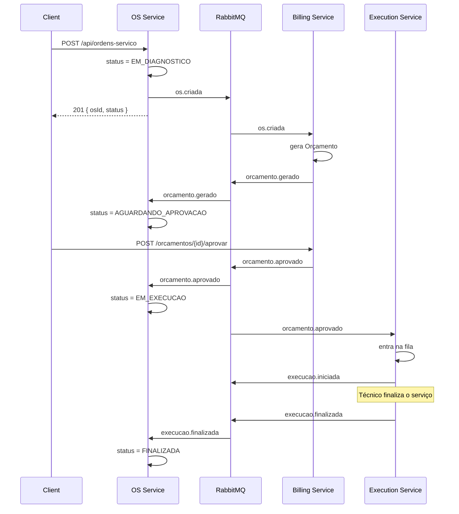
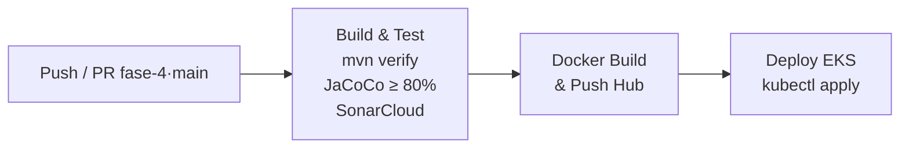

# Tech Challenge — Fase 4 | OS Service (Ordem de Serviço)

[](https://www.oracle.com/java/)
[](https://spring.io/projects/spring-boot)
[](https://www.postgresql.org/)
[](https://www.rabbitmq.com/)
[](#-testes-e-qualidade)
[](.github/workflows/ci-cd-os-service.yml)

Microsserviço responsável pelo ciclo de vida das **Ordens de Serviço** de uma oficina mecânica. Faz parte da arquitetura distribuída do Tech Challenge — FIAP Pós Tech (turma 13SOAT) — Fase 4.

> **Branch ativa:** `fase-4` (mergeada em `main` para entrega).

---

## Mapa da Fase 4 — Repositórios

| Repositório | Serviço | Linguagem / Banco | Pipeline |
|---|---|---|---|
| [**Tech-Challenge**](https://github.com/VitorVieira12/Tech-Challenge) (este) | OS Service | Java 21 / PostgreSQL (RDS) | [](https://github.com/VitorVieira12/Tech-Challenge/actions/workflows/ci-cd-os-service.yml) |
| [**tech-challenge-billing-service**](https://github.com/VitorVieira12/tech-challenge-billing-service) | Billing Service | Java 21 / PostgreSQL (RDS) | [](https://github.com/VitorVieira12/tech-challenge-billing-service/actions) |
| [**tech-challenge-execution-service**](https://github.com/VitorVieira12/tech-challenge-execution-service) | Execution Service | Java 21 / MongoDB (Atlas) | [](https://github.com/VitorVieira12/tech-challenge-execution-service/actions) |
| [tech-challenge-infra-k8s](https://github.com/VitorVieira12/tech-challenge-infra-k8s) | Infra Kubernetes (EKS) | Terraform | — |
| [tech-challenge-infra-db](https://github.com/VitorVieira12/tech-challenge-infra-db) | Infra RDS | Terraform | — |
| [tech-challenge-lambda](https://github.com/VitorVieira12/tech-challenge-lambda) | Lambda Autenticação CPF/CNPJ | Java + SAM | — |

Documento completo da arquitetura: [`docs/ARQUITETURA_FASE4.md`](docs/ARQUITETURA_FASE4.md).

---

## Visão Geral da Arquitetura



### Justificativa da Divisão em Microsserviços

| Serviço | Por que é um serviço próprio |
|---|---|
| **OS Service** | Núcleo do domínio — proprietário da entidade `OrdemDeServico` e do estado canônico do ciclo de vida. Reage a eventos dos outros serviços para atualizar status. |
| **Billing Service** | Bounded context financeiro. Cobra concerns próprios (orçamentos, pagamentos, integração com Mercado Pago) que tipicamente seguem cadência regulatória/contábil diferente do operacional da oficina. |
| **Execution Service** | Fila de execução do chão de oficina. Padrão de leitura/escrita diferente (alto volume de updates de status incrementais, histórico evolutivo de etapas) → encaixe natural com banco **NoSQL** (schema flexível). |

### Bancos de Dados (SQL + NoSQL — requisito atendido)

| Serviço | Banco | Tipo | Justificativa |
|---|---|---|---|
| OS Service | PostgreSQL 15 (RDS) | **SQL** | Relacionamentos fortes entre OS, cliente, veículo, serviços e peças exigem ACID e foreign keys. |
| Billing Service | PostgreSQL 15 (RDS) | **SQL** | Dados financeiros (orçamentos/pagamentos) precisam de garantias ACID e auditabilidade. |
| Execution Service | MongoDB 7 (Atlas) | **NoSQL** | Documentos de execução com schema flexível (etapas, técnico, fotos, anotações). Sem necessidade de JOIN. |

**Regra de ouro respeitada:** nenhum serviço acessa diretamente o banco de outro — toda comunicação cross-service é via RabbitMQ ou REST.

---

## Saga Pattern — Coreografado

A coordenação transacional é feita **via eventos no RabbitMQ**, sem orquestrador central.

### Justificativa da escolha (Coreografia × Orquestração)

| Critério | Coreografia (escolhida) | Orquestração |
|---|---|---|
| Ponto único de falha | Não existe | Orquestrador é SPOF |
| Acoplamento | Baixo — serviços conhecem apenas eventos | Alto — orquestrador conhece todos |
| Complexidade inicial | Média | Alta (precisa do orquestrador) |
| Rastreabilidade | Exige distributed tracing | Centralizada no orquestrador |
| Resiliência | Alta — cada serviço sobrevive a quedas dos demais | Depende do orquestrador estar de pé |

**Decisão:** coreografia. Para 3 serviços com fluxo bem definido, evita o overhead de manter mais um componente e elimina o SPOF. A rastreabilidade é resolvida pelo New Relic distributed tracing (herdado da Fase 3).

### Fluxo principal



### Compensações (rollback)

| Evento de falha | Quem publica | Ação compensatória no OS Service |
|---|---|---|
| `orcamento.rejeitado` | Billing | OS → `CANCELADA` |
| `execucao.falhou` | Execution | OS volta para `EM_DIAGNOSTICO` (técnico reavalia) |
| `pagamento.falhou` | Billing | OS permanece em `AGUARDANDO_APROVACAO` (cliente refaz pagamento) |

---

## Comunicação Entre Microsserviços

- **Assíncrona (padrão):** RabbitMQ via Spring AMQP — exchanges `os.events`, `billing.events`, `execution.events`.
- **Síncrona (REST):** apenas Client → microsserviço; serviços não fazem chamadas REST cross-service.

### Tabela de Eventos

| Evento (routing key) | Exchange | Fila destino | Consumidor |
|---|---|---|---|
| `os.criada` | `os.events` | `billing.os.criada` | Billing Service |
| `orcamento.gerado` | `billing.events` | `os.orcamento.gerado` | OS Service |
| `orcamento.aprovado` | `billing.events` | `os.orcamento.aprovado`, `exec.orcamento.aprovado` | OS Service, Execution Service |
| `orcamento.rejeitado` | `billing.events` | `os.orcamento.rejeitado` | OS Service |
| `pagamento.confirmado` | `billing.events` | `os.pagamento.confirmado` | OS Service |
| `execucao.iniciada` | `execution.events` | `os.execucao.iniciada` | OS Service |
| `execucao.finalizada` | `execution.events` | `os.execucao.finalizada` | OS Service |
| `execucao.falhou` | `execution.events` | `os.execucao.falhou` | OS Service |

---

## Endpoints — OS Service

| Método | Endpoint | Descrição | Auth |
|---|---|---|---|
| POST | `/api/auth/login` | Login (obter JWT) | ❌ |
| POST | `/api/ordens-servico` | Criar OS — publica `os.criada` | ✅ |
| GET  | `/api/ordens-servico` | Listar OSs | ✅ |
| GET  | `/api/ordens-servico/{id}` | Buscar por ID | ✅ |
| PATCH | `/api/ordens-servico/{id}/status` | Atualizar status manualmente | ✅ |
| POST | `/api/ordens-servico/{id}/aprovar-orcamento` | Aprovar/recusar orçamento (legado, hoje feito via Billing) | ✅ |
| GET | `/api/ordens-servico/em-andamento` | Listar OSs em andamento | ✅ |
| GET | `/api/ordens-servico/status/{id}?cpfCnpj=...` | Consulta pública por CPF/CNPJ | ❌ |
| GET | `/api/ordens-servico/monitoramento/tempo-medio` | Estatísticas de tempo médio | ✅ |

**Swagger:** `http://<host>:8080/swagger-ui.html` · **OpenAPI JSON:** `/v3/api-docs`

---

## Como Rodar Localmente (todos os serviços + RabbitMQ)

```bash
# Sobe Postgres OS + Postgres Billing + MongoDB + RabbitMQ + OS Service
docker-compose up -d

# Acompanhe os logs
docker-compose logs -f os-service
```

URLs locais:

- OS Service:        http://localhost:8080/swagger-ui.html
- RabbitMQ UI:       http://localhost:15672 (guest/guest)
- Billing Service:   http://localhost:8081/swagger-ui.html *(rodar do repo dedicado)*
- Execution Service: http://localhost:8082/swagger-ui.html *(rodar do repo dedicado)*

---

## Testes e Qualidade

| Categoria | Ferramenta | Status |
|---|---|---|
| Unitários | JUnit 5 + Mockito | ✅ 120+ testes |
| BDD | Cucumber 7 (6 cenários cobrindo Saga + rollback) | ✅ [`ordem_servico.feature`](src/test/resources/features/ordem_servico.feature) |
| Integração | Testcontainers (PostgreSQL) + Spring Boot Test | ✅ |
| Cobertura | JaCoCo — **gate de 80% (BUNDLE/LINE)** | ✅ Veja [`pom.xml`](pom.xml) |
| Quality Gate | **SonarCloud** — `VitorVieira12_Tech-Challenge` | ✅ Roda no CI a cada push em `fase-4`/`main` |

### Rodar testes

```bash
./mvnw verify        # roda surefire + failsafe + jacoco check + report
./mvnw test          # apenas unitários
```

Relatório HTML: `target/site/jacoco/index.html`

### Estratégia de cobertura

O `jacoco-check` mede a **lógica de domínio** (services, usecases, value objects, modelos, consumers de mensageria). Estão excluídos do gate:

- **Camadas de borda:** controllers, security, config — cobertos por testes de integração.
- **DTOs e exception handlers REST:** Lombok-generated / framework-integration.
- **Publishers / configurações AMQP:** integração de infraestrutura validada localmente.
- **Resíduos da refatoração Clean Architecture:** `core/**`, `adapters/**`, `infrastructure/**` (mantidos por compatibilidade, não exercitados).

---

## CI/CD

Pipeline em [`.github/workflows/ci-cd-os-service.yml`](.github/workflows/ci-cd-os-service.yml) com 3 estágios:



**Secrets necessárias no repositório:**
`DOCKER_USERNAME`, `DOCKER_PASSWORD`, `AWS_ACCESS_KEY_ID`, `AWS_SECRET_ACCESS_KEY`, `SONAR_TOKEN`, `SONAR_HOST_URL`.

Branch `main` protegida — exige PR + checks verdes.

---

## Kubernetes

Manifests em [`k8s/`](k8s/):

- [`os-service.yml`](k8s/os-service.yml) — Namespace + ConfigMap + Deployment + Service (LoadBalancer)
- [`billing-service.yml`](k8s/billing-service.yml) — espelho para o Billing Service
- [`execution-service.yml`](k8s/execution-service.yml) — espelho para o Execution Service
- [`rabbitmq.yml`](k8s/rabbitmq.yml) — broker compartilhado
- [`seed-data.sql`](k8s/seed-data.sql) — dados de demonstração

Secrets dos bancos / RabbitMQ / Mercado Pago são gerenciados via `kubectl create secret` (script em [`k8s/setup-secrets.sh`](k8s/setup-secrets.sh)).

---

## Observabilidade

**New Relic** (herdado da Fase 3) — distributed tracing através dos 3 microsserviços e do RabbitMQ.

- App name: `Tech Challenge - Oficina` (e os 2 análogos)
- Agent jar: `newrelic.yml` carregado via Dockerfile
- Dashboard pronto: [`docs/newrelic-dashboard.json`](docs/newrelic-dashboard.json)

---

## Entregáveis da Fase 4

| Item | Status | Onde |
|---|---|---|
| 3 microsserviços em repos separados | ✅ | Tabela no topo |
| Banco SQL + NoSQL | ✅ | PostgreSQL + MongoDB |
| Comunicação assíncrona via RabbitMQ | ✅ | `messaging/` |
| Saga Pattern coreografado + rollback | ✅ | `docs/ARQUITETURA_FASE4.md` §4 |
| Testes unitários nos 3 serviços | ✅ | `src/test/` em cada repo |
| BDD com fluxo completo | ✅ | `ordem_servico.feature` (6 cenários) |
| Cobertura ≥ 80% por serviço | ✅ | JaCoCo gate ativo nos 3 |
| Quality Gate (SonarCloud) | ✅ | Roda no CI |
| CI/CD por serviço com deploy em K8s | ✅ | `.github/workflows/` |
| Dockerfile + manifests K8s por serviço | ✅ | `Dockerfile` + `k8s/` |
| Swagger por serviço | ✅ | `/swagger-ui.html` |
| Observabilidade | ✅ | New Relic distributed tracing |
| Diagramas da arquitetura final | ✅ | `docs/ARQUITETURA_FASE4.md` |

---

## Colaborador avaliador

- **soat-architecture** — adicionado como colaborador para avaliação nos 3 repositórios.

---

## Documentação adicional

- [`docs/ARQUITETURA_FASE4.md`](docs/ARQUITETURA_FASE4.md) — arquitetura completa
- [`docs/ARQUITETURA_FASE3.md`](docs/ARQUITETURA_FASE3.md) — base herdada (Lambda, EKS, RDS)
- [`docs/ADR.md`](docs/ADR.md) — Architecture Decision Records
- [`API_DOCUMENTATION.md`](API_DOCUMENTATION.md) — referência completa da API
- [`API_EXAMPLES.http`](API_EXAMPLES.http) — exemplos REST Client
