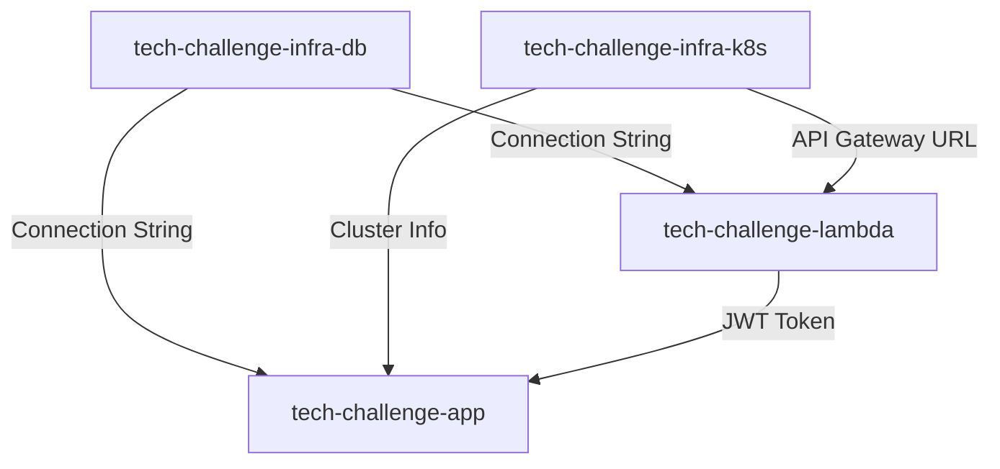

# Repositórios do Tech Challenge - Fase 3

## 📦 Estrutura dos 4 Repositórios

Este projeto está dividido em 4 repositórios independentes, cada um com seu próprio CI/CD pipeline.

## 1️⃣ tech-challenge-lambda

**Descrição**: Function AWS Lambda para autenticação serverless por CPF

**Repositório GitHub**: `https://github.com/seu-usuario/tech-challenge-lambda`

**Tecnologias**:
- Java 21 + GraalVM Native
- AWS Lambda
- PostgreSQL JDBC
- JWT (jjwt)
- AWS SAM

**CI/CD**: GitHub Actions → Build Native Image → Deploy Lambda

[Ver estrutura completa →](./repo-structures/lambda/README.md)

---

## 2️⃣ tech-challenge-infra-k8s

**Descrição**: Infraestrutura Kubernetes (EKS) e API Gateway usando Terraform

**Repositório GitHub**: `https://github.com/seu-usuario/tech-challenge-infra-k8s`

**Tecnologias**:
- Terraform (AWS Provider)
- AWS EKS
- AWS API Gateway
- AWS VPC, Subnets, Security Groups
- Kubernetes Manifests (YAML)

**CI/CD**: GitHub Actions → Terraform Plan/Apply → Deploy EKS

[Ver estrutura completa →](./repo-structures/infra-k8s/README.md)

---

## 3️⃣ tech-challenge-infra-db

**Descrição**: Banco de dados PostgreSQL RDS usando Terraform

**Repositório GitHub**: `https://github.com/seu-usuario/tech-challenge-infra-db`

**Tecnologias**:
- Terraform (AWS Provider)
- AWS RDS PostgreSQL
- Flyway Migrations
- Security Groups
- Backup Policies

**CI/CD**: GitHub Actions → Terraform Plan/Apply → Create/Update RDS

[Ver estrutura completa →](./repo-structures/infra-db/README.md)

---

## 4️⃣ tech-challenge-app

**Descrição**: Aplicação Spring Boot com Clean Architecture (este repositório atual refatorado)

**Repositório GitHub**: `https://github.com/seu-usuario/tech-challenge-app`

**Tecnologias**:
- Java 21 + Spring Boot 3
- Clean Architecture (Hexagonal)
- PostgreSQL
- Docker
- New Relic APM
- Kubernetes

**CI/CD**: GitHub Actions → Test → Build Docker → Push Registry → Deploy EKS

[Ver estrutura completa →](./README.md)

---

## 🚀 Ordem de Criação Recomendada

1. **tech-challenge-infra-db** (criar banco primeiro)
   ```bash
   gh repo create tech-challenge-infra-db --public
   cd tech-challenge-infra-db
   # Copiar estrutura da pasta repo-structures/infra-db/
   terraform init
   terraform plan
   terraform apply
   ```

2. **tech-challenge-infra-k8s** (criar cluster Kubernetes)
   ```bash
   gh repo create tech-challenge-infra-k8s --public
   cd tech-challenge-infra-k8s
   # Copiar estrutura da pasta repo-structures/infra-k8s/
   terraform init
   terraform plan
   terraform apply
   ```

3. **tech-challenge-lambda** (criar função de autenticação)
   ```bash
   gh repo create tech-challenge-lambda --public
   cd tech-challenge-lambda
   # Copiar estrutura da pasta repo-structures/lambda/
   sam build
   sam deploy
   ```

4. **tech-challenge-app** (fazer fork/refactor deste repo)
   ```bash
   # Criar novo repo ou fazer fork do atual
   gh repo create tech-challenge-app --public
   # Copiar código refatorado com Clean Architecture
   docker build -t tech-challenge-app .
   kubectl apply -f k8s/
   ```

---

## 🔐 Configuração de Secrets

### Para TODOS os repositórios

Configure os seguintes GitHub Secrets:

```bash
# AWS Credentials
AWS_ACCESS_KEY_ID=AKIA...
AWS_SECRET_ACCESS_KEY=...
AWS_REGION=us-east-1

# Docker Hub (para tech-challenge-app)
DOCKER_USERNAME=seu-usuario
DOCKER_PASSWORD=...

# New Relic (para tech-challenge-app)
NEW_RELIC_LICENSE_KEY=...

# Database
DB_HOST=tech-challenge-db.xxx.us-east-1.rds.amazonaws.com
DB_NAME=tech_challenge
DB_USERNAME=admin
DB_PASSWORD=...

# JWT Secret
JWT_SECRET=sua-chave-secreta-aqui
```

---

## 👥 Adicionar Colaborador

Em CADA repositório, adicionar o usuário `soat-architecture`:

```bash
# Via GitHub CLI
gh api -X PUT /repos/seu-usuario/tech-challenge-lambda/collaborators/soat-architecture

# Ou via GitHub Web:
# Settings → Collaborators → Add people → "soat-architecture"
```

---

## 🛡️ Branch Protection

Configure branch protection para `main` em TODOS os repositórios:

**Settings → Branches → Add rule:**
- Branch name pattern: `main`
- ✅ Require pull request reviews before merging
- ✅ Require status checks to pass before merging
- ✅ Require branches to be up to date before merging
- ✅ Include administrators

---

## 📊 Dependências entre Repositórios



---

## 🔄 Fluxo de Deploy Completo

1. **Provisionar Banco de Dados**
   ```bash
   cd tech-challenge-infra-db
   terraform apply
   # Output: DB endpoint
   ```

2. **Provisionar Kubernetes + API Gateway**
   ```bash
   cd tech-challenge-infra-k8s
   terraform apply
   # Output: Cluster name, API Gateway URL
   ```

3. **Deploy Lambda de Autenticação**
   ```bash
   cd tech-challenge-lambda
   sam deploy
   # Output: Lambda ARN
   ```

4. **Deploy Aplicação no Kubernetes**
   ```bash
   cd tech-challenge-app
   docker build -t seu-usuario/tech-challenge-app:latest .
   docker push seu-usuario/tech-challenge-app:latest
   kubectl apply -f k8s/
   # Output: Service LoadBalancer URL
   ```

5. **Configurar API Gateway para rotear para Lambda + ALB**
   ```bash
   # POST /auth/cpf → Lambda
   # /* → ALB do EKS
   ```

---

## 📁 Estrutura de Arquivos

Veja as pastas:
- [`repo-structures/lambda/`](./repo-structures/lambda/) - Estrutura completa do repo Lambda
- [`repo-structures/infra-k8s/`](./repo-structures/infra-k8s/) - Estrutura completa do repo Infra K8s
- [`repo-structures/infra-db/`](./repo-structures/infra-db/) - Estrutura completa do repo Infra DB
- Repo App = este repositório atual (já configurado)

---

## ✅ Checklist de Criação

### tech-challenge-lambda
- [ ] Repositório criado no GitHub
- [ ] Colaborador `soat-architecture` adicionado
- [ ] Branch protection configurada
- [ ] GitHub Secrets configurados
- [ ] README.md completo
- [ ] Código Lambda implementado
- [ ] CI/CD configurado (`.github/workflows/deploy.yml`)
- [ ] Testes unitários
- [ ] Deploy testado

### tech-challenge-infra-k8s
- [ ] Repositório criado no GitHub
- [ ] Colaborador `soat-architecture` adicionado
- [ ] Branch protection configurada
- [ ] GitHub Secrets configurados
- [ ] README.md completo
- [ ] Terraform EKS configurado
- [ ] Terraform API Gateway configurado
- [ ] CI/CD configurado (`.github/workflows/terraform.yml`)
- [ ] Manifests K8s criados
- [ ] Deploy testado

### tech-challenge-infra-db
- [ ] Repositório criado no GitHub
- [ ] Colaborador `soat-architecture` adicionado
- [ ] Branch protection configurada
- [ ] GitHub Secrets configurados
- [ ] README.md completo
- [ ] Terraform RDS configurado
- [ ] Migrations Flyway configuradas
- [ ] CI/CD configurado (`.github/workflows/terraform.yml`)
- [ ] Deploy testado

### tech-challenge-app
- [ ] Repositório criado no GitHub (ou fork)
- [ ] Colaborador `soat-architecture` adicionado
- [ ] Branch protection configurada
- [ ] GitHub Secrets configurados
- [ ] README.md atualizado
- [ ] Clean Architecture refatorada
- [ ] New Relic integrado
- [ ] Docker image funcional
- [ ] CI/CD configurado (`.github/workflows/deploy.yml`)
- [ ] Deploy no EKS testado

---

## 🎯 Próximos Passos

Após criar os 4 repositórios:

1. Implementar Lambda de autenticação
2. Configurar Terraform para infraestrutura
3. Integrar New Relic na aplicação
4. Configurar pipelines CI/CD
5. Criar documentação arquitetural
6. Gravar vídeo demonstrativo
7. Preparar PDF de entrega

---

**Documentação criada para facilitar a separação em 4 repositórios independentes!** 🚀

