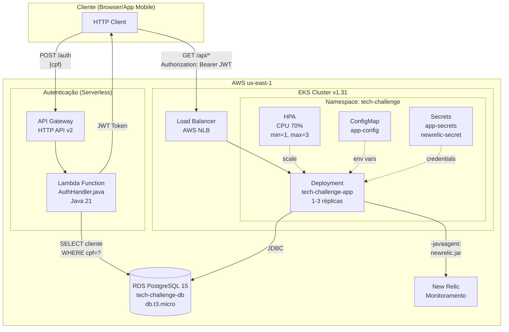
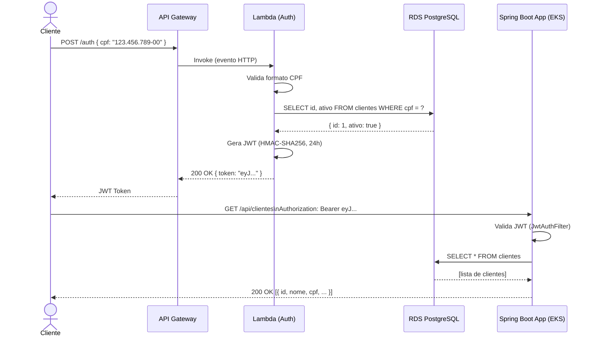
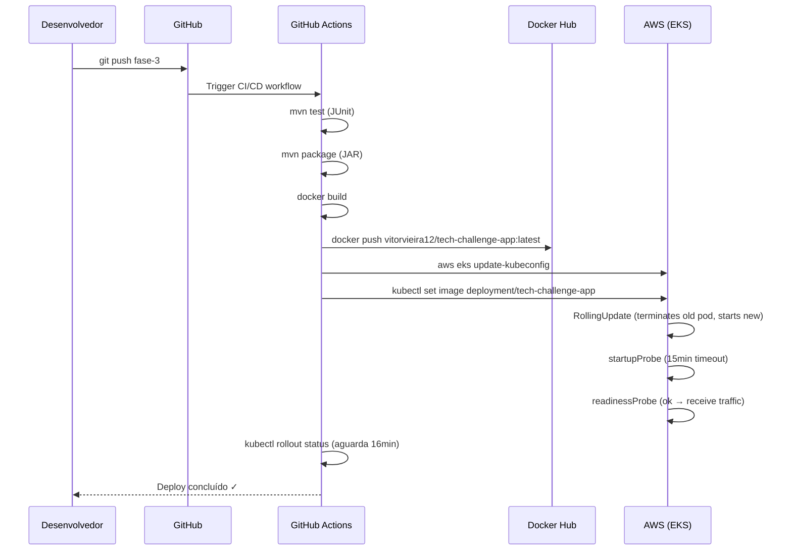
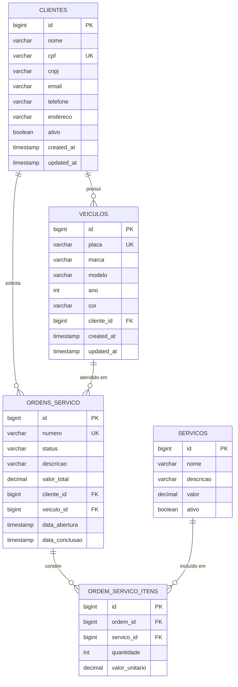
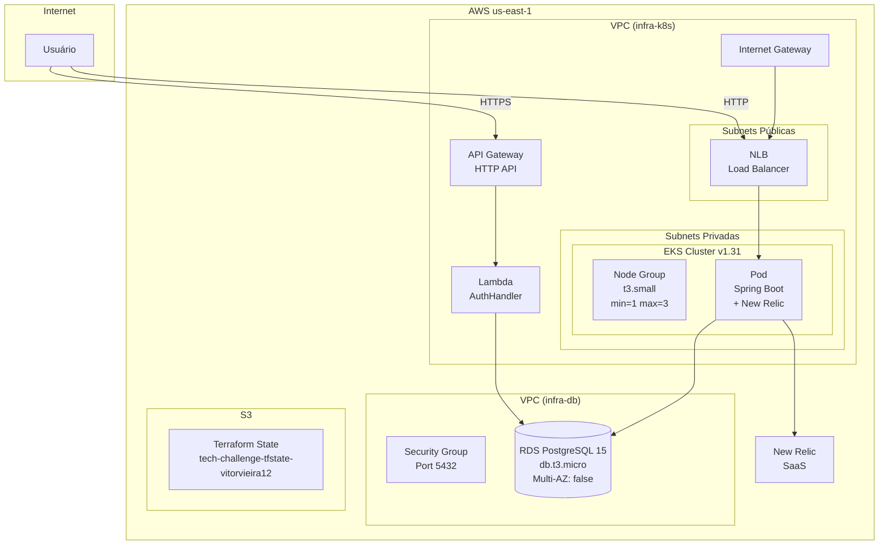

# Arquitetura Técnica — Tech Challenge Fase 3

> FIAP — Pós Tech | Software Architecture | Turma 13SOAT

## 1. Visão Geral do Sistema

O sistema gerencia uma **Oficina Mecânica**, permitindo o cadastro de clientes e veículos, agendamento de serviços e controle de ordens de serviço.

A Fase 3 introduz uma **arquitetura cloud-native** completa na AWS, com:
- **Autenticação serverless** via AWS Lambda + API Gateway
- **Aplicação principal em containers** no Amazon EKS (Kubernetes)
- **Banco de dados gerenciado** no Amazon RDS PostgreSQL
- **Monitoramento** via New Relic
- **CI/CD automatizado** via GitHub Actions + Terraform

---

## 2. Diagrama de Componentes



---

## 3. Diagrama de Sequência — Autenticação



---

## 4. Diagrama de Sequência — CI/CD Deploy



---

## 5. Diagrama ER — Banco de Dados



---

## 6. Diagrama de Infraestrutura AWS



---

## 7. Configuração de Monitoramento (New Relic)

### Métricas Monitoradas
- **JVM**: heap memory, GC, thread count
- **HTTP**: request rate, response time, error rate
- **Database**: query time, connection pool
- **Pod Health**: liveness, readiness, startup probes

### Alertas Configurados
| Condição | Threshold | Severidade |
|---|---|---|
| CPU > 80% | 5 minutos | Warning |
| Response Time > 2s | 3 minutos | Critical |
| Error Rate > 5% | 2 minutos | Critical |
| Pod Restarts > 3 | 10 minutos | Warning |

### Configuração do Agente
```dockerfile
# Dockerfile
ENTRYPOINT ["java",
  "-javaagent:/opt/newrelic/newrelic.jar",
  "-Xms256m", "-Xmx768m",
  "-jar", "app.jar"]
```

```yaml
# Kubernetes Secret (injetado pelo CI/CD)
NEW_RELIC_LICENSE_KEY: <valor do GitHub Secret>
NEW_RELIC_APP_NAME: "Tech Challenge - Oficina"
```

---

## 8. Repositórios e Branches

| Repositório | Branch Principal | Protegida | CI/CD |
|---|---|---|---|
| [Tech-Challenge](https://github.com/VitorVieira12/Tech-Challenge) | `fase-3` | ✅ PR obrigatório | Build → Push Docker → Deploy EKS |
| [tech-challenge-infra-db](https://github.com/VitorVieira12/tech-challenge-infra-db) | `main` | ✅ PR obrigatório | Terraform RDS |
| [tech-challenge-infra-k8s](https://github.com/VitorVieira12/tech-challenge-infra-k8s) | `main` | ✅ PR obrigatório | Terraform EKS + K8s Manifests |
| [tech-challenge-lambda](https://github.com/VitorVieira12/tech-challenge-lambda) | `main` | ✅ PR obrigatório | SAM Build + Deploy |
