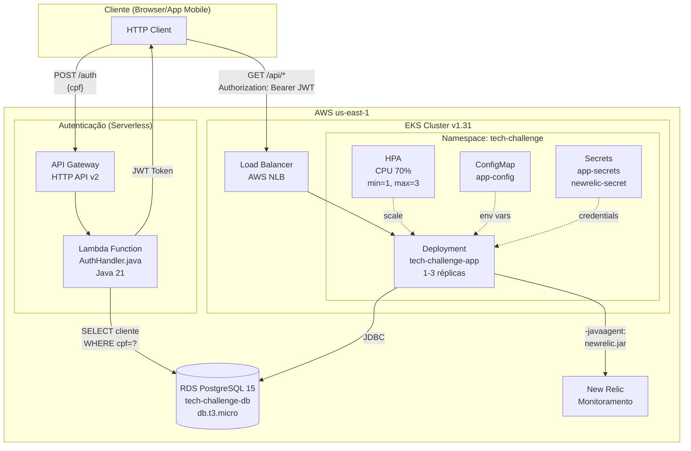
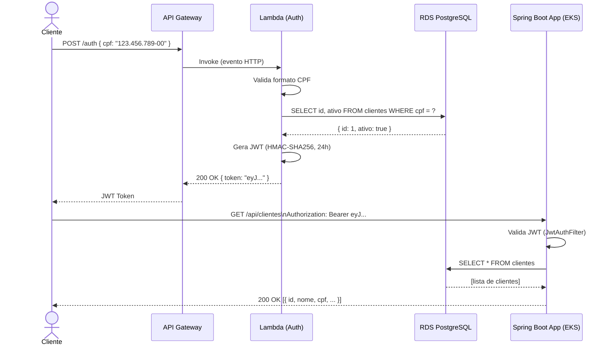
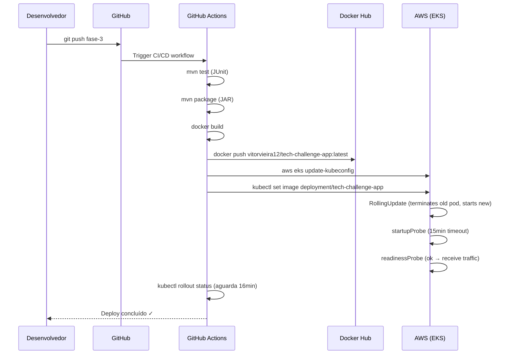
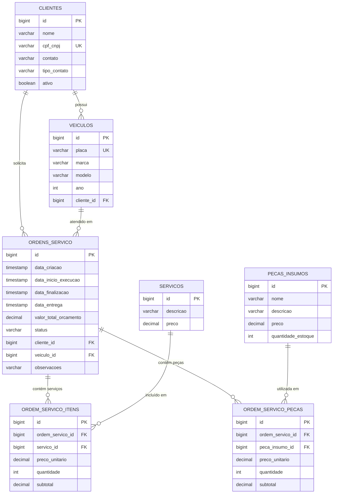
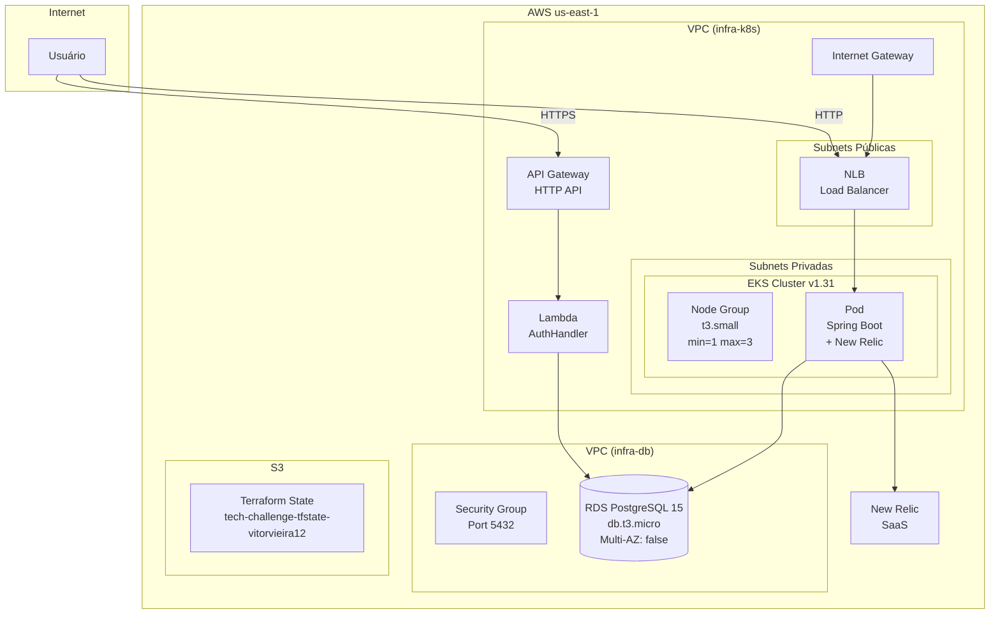

# Arquitetura Técnica — Tech Challenge Fase 3

> FIAP — Pós Tech | Software Architecture | Turma 13SOAT

## 1. Visão Geral do Sistema

O sistema gerencia uma **Oficina Mecânica**, permitindo o cadastro de clientes e veículos, agendamento de serviços e controle de ordens de serviço.

A Fase 3 introduz uma **arquitetura cloud-native** completa na AWS, com:
- **Autenticação serverless** via AWS Lambda + API Gateway
- **Aplicação principal em containers** no Amazon EKS (Kubernetes)
- **Banco de dados gerenciado** no Amazon RDS PostgreSQL
- **Monitoramento** via New Relic
- **CI/CD automatizado** via GitHub Actions + Terraform

---

## 2. Diagrama de Componentes



---

## 3. Diagrama de Sequência — Autenticação



---

## 4. Diagrama de Sequência — CI/CD Deploy



---

## 5. Diagrama ER — Banco de Dados

O modelo relacional é composto por **7 tabelas** que representam o domínio completo da oficina mecânica. As colunas abaixo refletem o mapeamento JPA real das entidades e value objects do código.



---

## 5.1 Justificativa Formal da Escolha do Banco de Dados

### Decisão: Amazon RDS PostgreSQL 15

A escolha pelo **PostgreSQL 15** como banco de dados da aplicação é fundamentada nos seguintes critérios técnicos e de negócio:

#### Por que banco relacional (SQL)?

O domínio de uma **oficina mecânica** possui dados altamente estruturados com relacionamentos bem definidos e obrigatórios:

- Um veículo **sempre** pertence a um cliente (restrição de integridade referencial)
- Uma ordem de serviço **sempre** referencia um cliente e um veículo específicos
- Os itens de uma OS referenciam serviços e peças cadastradas no catálogo

Essa natureza **fortemente relacional** torna bancos NoSQL inadequados, pois exigiriam desnormalização e perda de garantias de consistência que são críticas para um sistema financeiro/operacional.

#### Por que PostgreSQL em vez de alternativas relacionais?

| Critério | PostgreSQL 15 | MySQL 8 | Oracle | SQL Server |
|---|---|---|---|---|
| Licença | Open Source (PostgreSQL License) | GPL / Comercial | Comercial | Comercial |
| Suporte JSON | Nativo (JSONB) | Limitado | Limitado | Limitado |
| Compliance ACID | Completo | Completo | Completo | Completo |
| Hibernate/JPA | Dialeto nativo | Dialeto nativo | Dialeto nativo | Dialeto nativo |
| AWS RDS Free Tier | ✅ db.t3.micro | ✅ db.t3.micro | ❌ | ❌ |
| Extensibilidade | Alta | Média | Alta | Média |
| Custo | Gratuito | Gratuito | Alto | Alto |

O PostgreSQL foi escolhido por:
1. **Custo zero de licença** — essencial em ambiente de estudo/MVP
2. **Elegível para AWS Free Tier** (`db.t3.micro`) — reduz custos de infraestrutura
3. **Conformidade total com Hibernate/JPA** — sem adaptações necessárias no código Spring Boot
4. **Suporte a tipos avançados** — `NUMERIC(10,2)` para valores monetários, `TIMESTAMP` com precisão, `VARCHAR` com constraints
5. **Confiabilidade comprovada** — amplamente adotado em sistemas de produção de grande escala
6. **Integração com AWS RDS** — backups automáticos, patches gerenciados, Multi-AZ opcional

#### Por que Amazon RDS em vez de PostgreSQL em EC2?

| Critério | RDS PostgreSQL | PostgreSQL em EC2 |
|---|---|---|
| Backups automáticos | ✅ Configurável (1-35 dias) | ❌ Manual |
| Patches de segurança | ✅ Automáticos | ❌ Manuais |
| Failover automático | ✅ Multi-AZ (opcional) | ❌ Manual |
| Monitoramento | ✅ CloudWatch integrado | ❌ Configuração manual |
| Esforço operacional | Baixo | Alto |
| Custo | Ligeiramente maior | Menor |

**Conclusão:** O custo ligeiramente maior do RDS é amplamente compensado pela redução de esforço operacional e pelas garantias de disponibilidade e backup automático.

---

## 5.2 Modelo Relacional — Explicação dos Relacionamentos

### Entidades e suas responsabilidades

| Tabela | Responsabilidade |
|---|---|
| `clientes` | Cadastro de pessoas físicas (CPF) ou jurídicas (CNPJ) que contratam serviços |
| `veiculos` | Veículos pertencentes a clientes; cada veículo possui uma placa única brasileira |
| `ordens_servico` | Registro do atendimento: associa cliente + veículo + lista de serviços e peças |
| `servicos` | Catálogo de serviços disponíveis (ex.: troca de óleo, alinhamento) com preço de referência |
| `pecas_insumos` | Estoque de peças e insumos com controle de quantidade disponível |
| `ordem_servico_itens` | Tabela associativa: serviços efetivamente executados em uma OS (com preço e quantidade) |
| `ordem_servico_pecas` | Tabela associativa: peças efetivamente utilizadas em uma OS (com preço e quantidade) |

### Relacionamentos detalhados

#### CLIENTES → VEICULOS (1:N)
```
CLIENTES.id  ←→  VEICULOS.cliente_id
```
- **Cardinalidade:** Um cliente pode possuir **zero ou mais** veículos; um veículo pertence a **exatamente um** cliente.
- **Restrição:** `NOT NULL` em `cliente_id` — veículo sem dono é inválido no domínio da oficina.
- **Cascade:** `CascadeType.ALL` com `orphanRemoval = true` — ao excluir um cliente, seus veículos são removidos.
- **Justificativa de design:** A separação em tabelas distintas (ao invés de embutir veículo no cliente) permite que um cliente cadastre múltiplos veículos e que cada veículo tenha histórico de OSs independente.

#### CLIENTES → ORDENS_SERVICO (1:N)
```
CLIENTES.id  ←→  ORDENS_SERVICO.cliente_id
```
- **Cardinalidade:** Um cliente pode ter **zero ou mais** ordens de serviço; uma OS pertence a **exatamente um** cliente.
- **Restrição:** `NOT NULL` em `cliente_id` — toda OS exige um cliente responsável (para faturamento e histórico).
- **Justificativa de design:** Manter o cliente diretamente na OS (e não apenas via veículo) permite consultas de histórico por cliente mesmo que o veículo seja vendido, e facilita o faturamento direto ao titular.

#### VEICULOS → ORDENS_SERVICO (1:N)
```
VEICULOS.id  ←→  ORDENS_SERVICO.veiculo_id
```
- **Cardinalidade:** Um veículo pode ter **zero ou mais** OSs; cada OS é para **um único** veículo.
- **Restrição:** `NOT NULL` em `veiculo_id` — a OS deve sempre identificar qual veículo está sendo atendido.
- **Justificativa de design:** Separar veículo de cliente na OS permite rastrear o histórico de manutenção do veículo independentemente do proprietário atual (útil em casos de troca de titularidade).

#### ORDENS_SERVICO → ORDEM_SERVICO_ITENS (1:N) — Serviços da OS
```
ORDENS_SERVICO.id  ←→  ORDEM_SERVICO_ITENS.ordem_servico_id
SERVICOS.id        ←→  ORDEM_SERVICO_ITENS.servico_id
```
- **Cardinalidade:** Uma OS pode conter **zero ou mais** itens de serviço; cada item pertence a **uma** OS e referencia **um** serviço do catálogo.
- **Restrição:** Ambas as FKs são `NOT NULL`.
- **Cascade:** `CascadeType.ALL` com `orphanRemoval = true` — itens não existem fora de uma OS.
- **Campos próprios:** `preco_unitario`, `quantidade` e `subtotal` são armazenados na tabela associativa (não reutilizados do catálogo), garantindo que alterações futuras no preço do serviço não retroajam em OSs históricas.
- **Justificativa de design:** O padrão de tabela associativa com dados de preço no item (e não apenas FK para o catálogo) é essencial para **auditoria financeira** — o preço cobrado deve ser imutável após a emissão da OS.

#### ORDENS_SERVICO → ORDEM_SERVICO_PECAS (1:N) — Peças da OS
```
ORDENS_SERVICO.id  ←→  ORDEM_SERVICO_PECAS.ordem_servico_id
PECAS_INSUMOS.id   ←→  ORDEM_SERVICO_PECAS.peca_insumo_id
```
- **Cardinalidade:** Uma OS pode consumir **zero ou mais** peças/insumos; cada registro de peça pertence a **uma** OS e referencia **uma** peça do estoque.
- **Restrição:** Ambas as FKs são `NOT NULL`.
- **Campos próprios:** `preco_unitario`, `quantidade` e `subtotal` — mesma razão dos itens de serviço (imutabilidade histórica do preço).
- **Efeito colateral:** Ao adicionar uma peça à OS, o sistema deduz `quantidade_estoque` em `PECAS_INSUMOS` (validação de disponibilidade no serviço de domínio).

#### SERVICOS → ORDEM_SERVICO_ITENS (1:N)
```
SERVICOS.id  ←→  ORDEM_SERVICO_ITENS.servico_id
```
- **Cardinalidade:** Um serviço do catálogo pode aparecer em **zero ou mais** itens de OS; cada item aponta para **um** serviço específico.
- **Justificativa de design:** O catálogo de serviços é independente das OSs, permitindo alterar preços e descrições sem impactar o histórico.

#### PECAS_INSUMOS → ORDEM_SERVICO_PECAS (1:N)
```
PECAS_INSUMOS.id  ←→  ORDEM_SERVICO_PECAS.peca_insumo_id
```
- **Cardinalidade:** Uma peça/insumo pode ser utilizada em **zero ou mais** OSs; cada registro de peça em OS aponta para **uma** peça do estoque.
- **Controle de estoque:** `quantidade_estoque` em `PECAS_INSUMOS` representa o saldo atual disponível, decrementado a cada uso.

### Decisões de normalização

O modelo segue a **3ª Forma Normal (3FN)**:
- Todas as colunas dependem exclusivamente da chave primária de sua tabela.
- Preços em `ORDEM_SERVICO_ITENS` e `ORDEM_SERVICO_PECAS` são intencionalmente **desnormalizados** (copiados do catálogo no momento da criação) para garantir imutabilidade histórica — exceção justificada por requisito de negócio.

### Value Objects e mapeamento JPA

O modelo usa **Value Objects embeddable** para encapsular regras de validação diretamente nas colunas:

| Value Object | Colunas geradas | Regra de negócio embutida |
|---|---|---|
| `CpfCnpj` | `cpf_cnpj` (UK, 14 chars) | Validação de dígitos verificadores de CPF e CNPJ |
| `Contato` | `contato`, `tipo_contato` | Aceita email válido ou telefone brasileiro |
| `Placa` | `placa` (UK, 10 chars) | Formato antigo (ABC1234) ou Mercosul (ABC1D23) |
| `AnoVeiculo` | `ano` | Intervalo 1900–(ano atual + 1) |
| `ValorMonetario` | `preco`, `preco_unitario`, `subtotal`, `valor_total_orcamento` | Valor não negativo, `NUMERIC(10,2)` |

---

## 6. Diagrama de Infraestrutura AWS



---

## 7. Configuração de Monitoramento (New Relic)

### Métricas Monitoradas
- **JVM**: heap memory, GC, thread count
- **HTTP**: request rate, response time, error rate
- **Database**: query time, connection pool
- **Pod Health**: liveness, readiness, startup probes

### Alertas Configurados
| Condição | Threshold | Severidade |
|---|---|---|
| CPU > 80% | 5 minutos | Warning |
| Response Time > 2s | 3 minutos | Critical |
| Error Rate > 5% | 2 minutos | Critical |
| Pod Restarts > 3 | 10 minutos | Warning |

### Configuração do Agente
```dockerfile
# Dockerfile
ENTRYPOINT ["java",
  "-javaagent:/opt/newrelic/newrelic.jar",
  "-Xms256m", "-Xmx768m",
  "-jar", "app.jar"]
```

```yaml
# Kubernetes Secret (injetado pelo CI/CD)
NEW_RELIC_LICENSE_KEY: <valor do GitHub Secret>
NEW_RELIC_APP_NAME: "Tech Challenge - Oficina"
```

---

## 8. Repositórios e Branches

| Repositório | Branch Principal | Protegida | CI/CD |
|---|---|---|---|
| [Tech-Challenge](https://github.com/VitorVieira12/Tech-Challenge) | `fase-3` | ✅ PR obrigatório | Build → Push Docker → Deploy EKS |
| [tech-challenge-infra-db](https://github.com/VitorVieira12/tech-challenge-infra-db) | `main` | ✅ PR obrigatório | Terraform RDS |
| [tech-challenge-infra-k8s](https://github.com/VitorVieira12/tech-challenge-infra-k8s) | `main` | ✅ PR obrigatório | Terraform EKS + K8s Manifests |
| [tech-challenge-lambda](https://github.com/VitorVieira12/tech-challenge-lambda) | `main` | ✅ PR obrigatório | SAM Build + Deploy |
