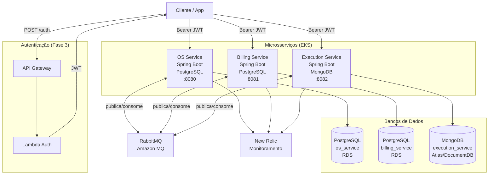
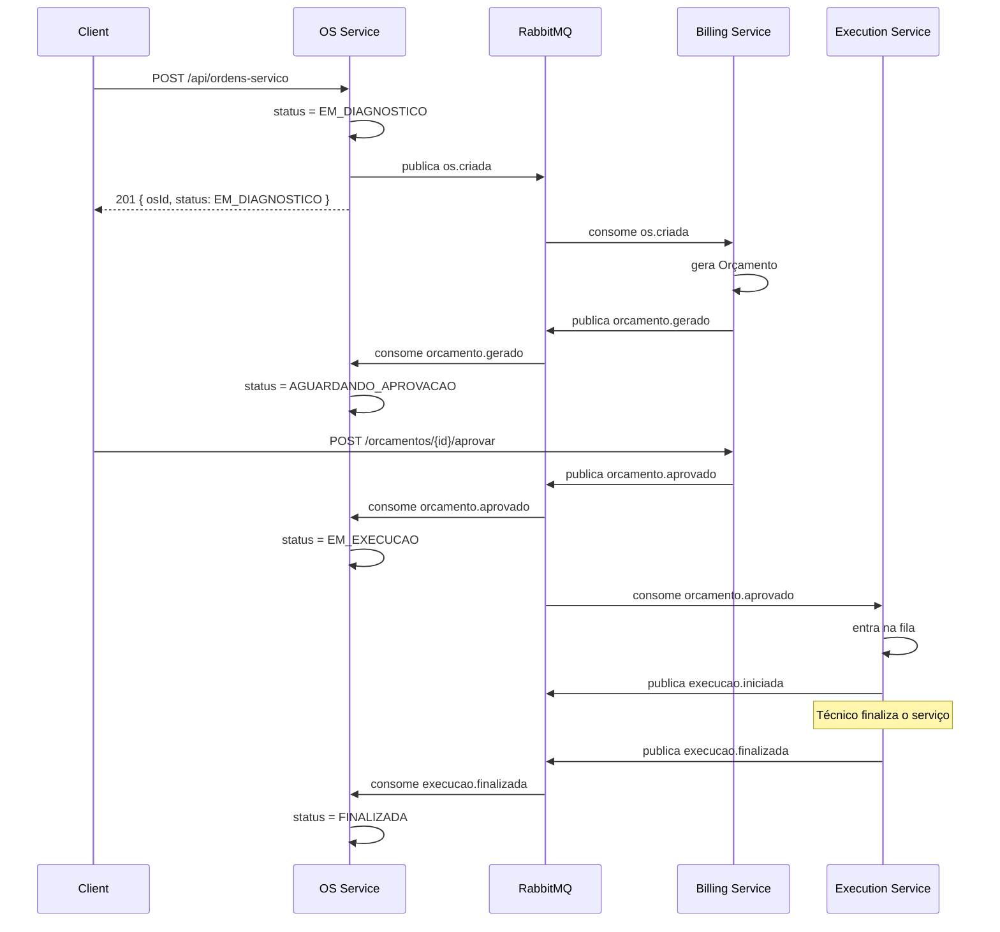
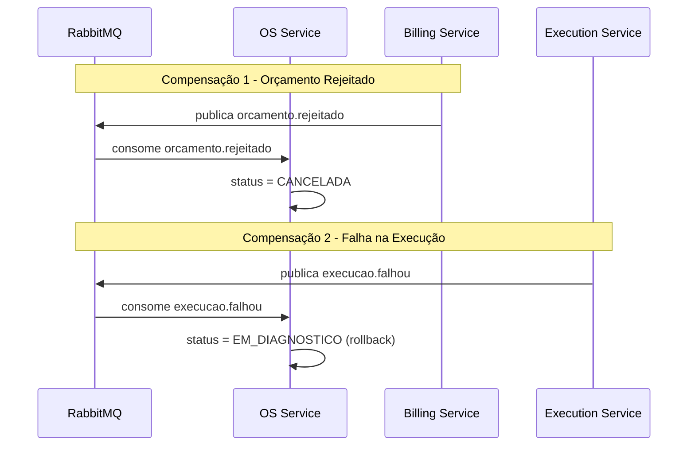
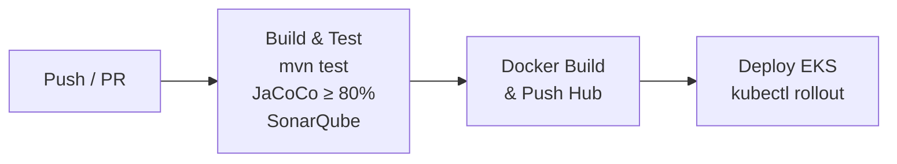

# Arquitetura Técnica — Tech Challenge Fase 4

> FIAP — Pós Tech | Software Architecture | Turma 13SOAT

## 1. Visão Geral

A Fase 4 evolui o monolito da Fase 3 para uma **arquitetura de microsserviços** com:

- **3 microsserviços independentes**, cada um com repositório e banco de dados próprio
- **RabbitMQ** como broker de mensageria assíncrona
- **Saga Pattern Coreografado** para coordenação transacional distribuída
- **CI/CD independente** por serviço via GitHub Actions
- **Kubernetes (EKS)** para orquestração de containers
- **Monitoramento** via New Relic (herança da Fase 3)

---

## 2. Diagrama Geral de Componentes



---

## 3. Microsserviços

### 3.1 OS Service (Ordem de Serviço)
- **Repositório:** `Tech-Challenge` (branch `fase-4`)
- **Porta:** `8080`
- **Banco:** PostgreSQL — RDS existente (tabelas: `ordens_servico`, `clientes`, `veiculos`, `servicos`, `pecas_insumos`)
- **Responsabilidade:** Ciclo de vida completo das OSs — criar, consultar status, histórico

| Endpoint | Método | Descrição |
|---|---|---|
| `/api/ordens-servico` | POST | Criar OS (publica `os.criada`, status inicial: `EM_DIAGNOSTICO`) |
| `/api/ordens-servico/{id}` | GET | Buscar OS por ID |
| `/api/ordens-servico/status/{id}` | GET | Consulta pública de status (CPF obrigatório) |
| `/api/ordens-servico/em-andamento` | GET | Listar OSs em andamento |
| `/api/ordens-servico/{id}/status` | PATCH | Atualizar status manualmente |

**Eventos publicados:** `os.criada`
**Eventos consumidos:** `orcamento.gerado`, `orcamento.aprovado`, `orcamento.rejeitado`, `pagamento.confirmado`, `execucao.finalizada`, `execucao.falhou`

### 3.2 Billing Service (Orçamentos e Pagamentos)
- **Repositório:** `tech-challenge-billing-service`
- **Porta:** `8081`
- **Banco:** PostgreSQL — novo RDS (tabelas: `orcamentos`, `pagamentos`)
- **Responsabilidade:** Geração de orçamentos, aprovação/rejeição, pagamentos via Mercado Pago

| Endpoint | Método | Descrição |
|---|---|---|
| `/orcamentos` | GET | Listar todos os orçamentos |
| `/orcamentos/{id}` | GET | Buscar orçamento |
| `/orcamentos/os/{osId}` | GET | Buscar orçamento pela OS |
| `/orcamentos/{id}/aprovar` | POST | Cliente aprova orçamento |
| `/orcamentos/{id}/rejeitar` | POST | Cliente rejeita orçamento |
| `/pagamentos/link/{orcamentoId}` | POST | Gerar link de pagamento (Mercado Pago) |
| `/pagamentos/webhook` | POST | Webhook de notificação do Mercado Pago |
| `/pagamentos/confirmar/{osId}` | POST | Confirmar pagamento manual (sandbox/testes) |

**Eventos publicados:** `orcamento.gerado`, `orcamento.aprovado`, `orcamento.rejeitado`, `pagamento.confirmado`, `pagamento.falhou`
**Eventos consumidos:** `os.criada`

### 3.3 Execution Service (Execução e Diagnóstico)
- **Repositório:** `tech-challenge-execution-service`
- **Porta:** `8082`
- **Banco:** MongoDB — Atlas/DocumentDB (coleções: `execucoes`)
- **Responsabilidade:** Fila de execução, atualização de status durante diagnóstico/reparo

| Endpoint | Método | Descrição |
|---|---|---|
| `/execucoes` | GET | Listar fila de execução (ordenada) |
| `/execucoes/os/{osId}` | GET | Buscar execução pela OS |
| `/execucoes/{id}` | GET | Buscar execução por ID |
| `/execucoes/os/{osId}/status` | PATCH | Atualizar status (diagnóstico → em execução → finalizada) |
| `/execucoes/status/{status}` | GET | Listar por status |

**Eventos publicados:** `execucao.iniciada`, `execucao.finalizada`, `execucao.falhou`
**Eventos consumidos:** `orcamento.aprovado`

---

## 4. Saga Pattern — Coreografado

### Justificativa da Escolha: Coreografia vs Orquestração

| Critério | Coreografia ✅ | Orquestração |
|---|---|---|
| Ponto único de falha | Não existe | Orquestrador é SPOF |
| Acoplamento | Baixo (eventos) | Alto (orquestrador conhece todos) |
| Complexidade inicial | Média | Alta (implementar orquestrador) |
| Rastreabilidade | Requer distributed tracing | Centralizada no orquestrador |
| Resiliência | Alta | Depende da disponibilidade do orquestrador |

**Decisão:** Coreografia foi escolhida pela **ausência de ponto único de falha** e **menor acoplamento** entre os serviços, adequada para 3 microsserviços com fluxo bem definido.

### Fluxo Principal



### Rollbacks (Compensações)



---

## 5. Bancos de Dados

| Serviço | Banco | Tipo | Justificativa |
|---|---|---|---|
| OS Service | PostgreSQL 15 (RDS) | SQL | Dados relacionais fortes (OS ↔ cliente ↔ veículo ↔ serviços) |
| Billing Service | PostgreSQL 15 (RDS) | SQL | Dados financeiros exigem ACID, auditabilidade e consistência |
| Execution Service | MongoDB 7 (Atlas/DocumentDB) | NoSQL | Logs de execução são documentos com schema flexível por fase |

---

## 6. Mensageria — RabbitMQ

**Broker:** Amazon MQ for RabbitMQ (prod) / RabbitMQ containerizado (local)

| Exchange | Tipo | Publicado por | Consumido por |
|---|---|---|---|
| `os.events` | Topic | OS Service | Billing Service |
| `billing.events` | Topic | Billing Service | OS Service, Execution Service |
| `execution.events` | Topic | Execution Service | OS Service |

### Mapa de Eventos e Filas

| Evento (routing key) | Exchange | Fila destino | Consumidor |
|---|---|---|---|
| `os.criada` | `os.events` | `billing.os.criada` | Billing Service |
| `orcamento.gerado` | `billing.events` | `os.orcamento.gerado` | OS Service |
| `orcamento.aprovado` | `billing.events` | `os.orcamento.aprovado`, `exec.orcamento.aprovado` | OS Service, Execution Service |
| `orcamento.rejeitado` | `billing.events` | `os.orcamento.rejeitado` | OS Service |
| `pagamento.confirmado` | `billing.events` | `os.pagamento.confirmado` | OS Service |
| `execucao.iniciada` | `execution.events` | `os.execucao.iniciada` | OS Service |
| `execucao.finalizada` | `execution.events` | `os.execucao.finalizada` | OS Service |
| `execucao.falhou` | `execution.events` | `os.execucao.falhou` | OS Service |

---

## 7. CI/CD por Serviço

Cada repositório possui pipeline independente no GitHub Actions com 3 estágios:



**Secrets necessários (por repositório):**
- `DOCKERHUB_USERNAME`, `DOCKERHUB_TOKEN`
- `AWS_ACCESS_KEY_ID`, `AWS_SECRET_ACCESS_KEY`
- `SONAR_TOKEN`, `SONAR_HOST_URL`
- `MERCADOPAGO_ACCESS_TOKEN` (somente Billing Service)

---

## 8. Infraestrutura Kubernetes

```
Namespaces:
  os-service/         → Deployment, Service, HPA, ConfigMap, Secrets
  billing-service/    → Deployment, Service, HPA, ConfigMap, Secrets
  execution-service/  → Deployment, Service, HPA, ConfigMap, Secrets
  rabbitmq/           → Deployment, Service, Secret
```

---

## 9. Testes e Qualidade

| Tipo | Ferramenta | Cobertura |
|---|---|---|
| Unitários | JUnit 5 + Mockito | ≥ 80% por serviço (JaCoCo) |
| BDD | Cucumber 7 + JUnit Platform | Fluxo completo OS (6 cenários) |
| Integração | Testcontainers | PostgreSQL, MongoDB, RabbitMQ |
| Qualidade | SonarQube | Quality Gate no CI |

---

## 10. ADRs — Architecture Decision Records

### ADR-001: Coreografia vs Orquestração do Saga
- **Contexto:** 3 microsserviços com fluxo transacional distribuído
- **Decisão:** Coreografia via eventos RabbitMQ
- **Justificativa:** Sem SPOF, menor acoplamento, adequado para escopo de 3 serviços
- **Consequências:** Rastreabilidade requer distributed tracing (New Relic já configurado)

### ADR-002: MongoDB para Execution Service
- **Contexto:** Necessidade de banco NoSQL obrigatório
- **Decisão:** MongoDB para logs de execução
- **Justificativa:** Schema flexível por fase de execução, documentos com histórico embutido, sem JOINs necessários
- **Consequências:** Sem garantias de transação ACID entre serviços (aceitável — cada serviço tem consistência eventual)

### ADR-003: RabbitMQ como Message Broker
- **Contexto:** Escolha de broker para mensageria assíncrona
- **Decisão:** RabbitMQ (Amazon MQ em prod)
- **Justificativa:** Suportado pelo AWS, fácil configuração local com Docker, Spring AMQP maduro, sem overhead de Kafka para 3 serviços
- **Consequências:** Menor throughput que Kafka (aceitável para o volume da oficina)

---

## 11. Repositórios

| Repositório | Serviço | Branch | Banco |
|---|---|---|---|
| `Tech-Challenge` | OS Service | `fase-4` | PostgreSQL (RDS) |
| `tech-challenge-billing-service` | Billing Service | `main` | PostgreSQL (RDS) |
| `tech-challenge-execution-service` | Execution Service | `main` | MongoDB (Atlas) |
| `tech-challenge-infra-k8s` | Infra K8s | `main` | — |
| `tech-challenge-infra-db` | Infra DB | `main` | — |
| `tech-challenge-lambda` | Lambda Auth | `main` | — |
